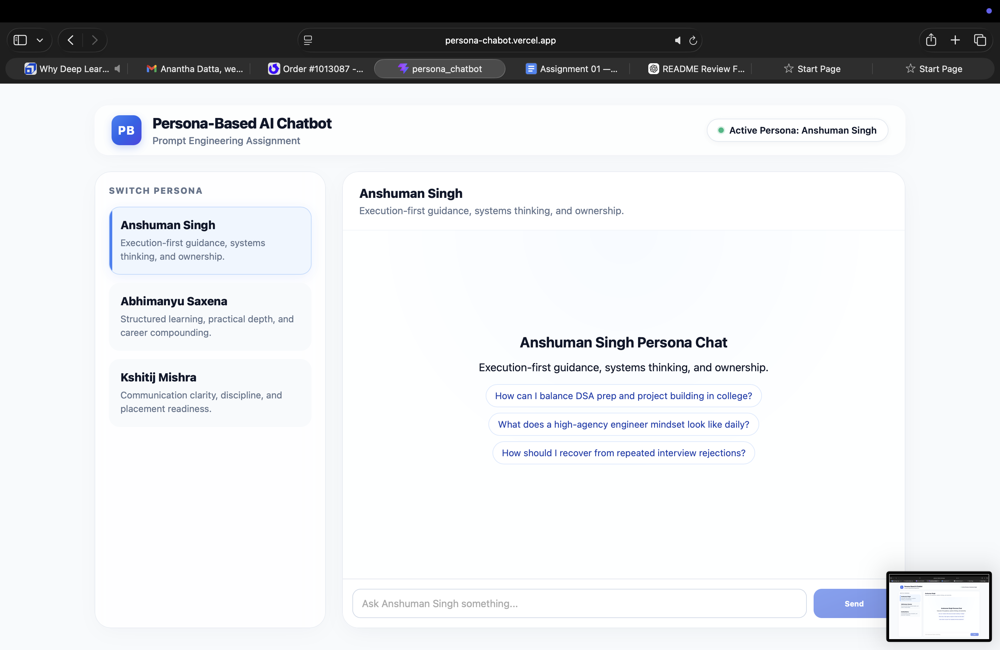

# Persona-Based AI Chatbot (Scaler Assignment 01)

A production-quality, responsive AI chatbot engineered to emulate the distinct personas of three Scaler founders/educators:

- **Anshuman Singh** (First-principles thinking, structured, highly logical)
- **Abhimanyu Saxena** (Visionary, storytelling, journey-focused)
- **Kshitij Mishra** (Grounded, outcome-driven, framework-based)

This project heavily emphasizes **Prompt Engineering**—using Chain-of-Thought reasoning, negative constraints, and few-shot examples to drastically alter the LLM's personality without fine-tuning.

---

## 📸 UI & Features

The application features a fully responsive, modern glassmorphism UI with:
- Dynamic Persona Switcher
- Typing Indicators & Interactive Suggestion Chips
- Auto-scrolling chat history
- Mobile-first CSS optimizations

*See the live deployment below to interact with the UI.*
https://persona-chabot.vercel.app

---

## ⚡ Tech Stack

- **Frontend:** React 19 + Vite (Modern, Glassmorphism UI, Responsive)
- **Backend:** Node.js + Express (REST API)
- **LLM API:** Google Gemini API (\`gemini-flash-latest\`)
- **Deployment Ready:** Vercel (Frontend) / Render (Backend)

---

## 🏗️ Project Structure

The repository is built as a clean, decoupled monorepo:

\`\`\`text
root/
 ├── frontend/          # React frontend application
 │    ├── src/          # Components, Hooks, and API calls
 │    └── package.json  # Frontend dependencies
 ├── backend/           # Express backend server
 │    ├── index.js      # Core API endpoints (/chat, /health)
 │    ├── personas.js   # Engineered Prompts & Metadata
 │    └── package.json  # Backend dependencies
 ├── prompts.md         # Detailed prompt engineering documentation
 ├── reflection.md      # 400-word assignment reflection
 ├── README.md          # Project documentation
 └── .env.example       # Template for environment variables
\`\`\`

---

## 🚀 Setup Instructions

Follow these steps to run the application locally.

### 1. Configure Environment Variables
Create a \`.env\` file in the root directory based on the provided template:
\`\`\`bash
cp .env.example .env
\`\`\`
Edit the \`.env\` file to add your Google Gemini API key:
\`\`\`env
GEMINI_API_KEY=your_actual_key_here
GEMINI_MODEL=gemini-flash-latest
PORT=8787
\`\`\`

### 2. Start the Backend Server
Open a terminal and run:
\`\`\`bash
cd backend
npm install
npm start
\`\`\`
*(The server will run on http://localhost:8787)*

### 3. Start the Frontend Application
Open a **new** terminal window and run:
\`\`\`bash
cd frontend
npm install
npm run dev
\`\`\`
*(The frontend will be available at http://localhost:5173)*

---

## 🌐 Deployment Links

- **Live Frontend (Vercel):** https://persona-chabot.vercel.app
- **Live Backend (Render):** https://persona-chabot.onrender.com

### Deployment Steps:
1. **Deploy Backend (Render):**
   - Connect your GitHub repo to Render and choose "Web Service".
   - Set **Root Directory** to `backend`.
   - Add Environment Variables: `GEMINI_API_KEY` (your key) and `GEMINI_MODEL` (`gemini-flash-latest`).
   - Copy the deployed Render URL (e.g., `https://my-backend.onrender.com`).
2. **Deploy Frontend (Vercel):**
   - Connect your GitHub repo to Vercel.
   - Set **Root Directory** to `frontend`.
   - Add Environment Variable: `VITE_API_URL` and paste your deployed Render URL (e.g., `https://my-backend.onrender.com`).

*(Note: Ensure there are no trailing slashes at the end of the `VITE_API_URL`.)*

---

## 🧠 Prompt Engineering Highlights

To achieve a 10/10 LLM integration, the following techniques were strictly applied in \`backend/personas.js\`:

1. **Chain-of-Thought (\`<thought>\`):** The LLM is forced to plan its response internally before generating user-facing text, drastically reducing hallucinations.
2. **Few-Shot Prompting:** Each persona contains 3 highly tailored Q&A examples dictating exactly how to sound.
3. **Strict Formatting:** Output is strictly constrained to 4-6 sentences, ending with a follow-up question.
4. **Negative Constraints:** Explicit rules preventing generic motivational fluff and breaking character.
